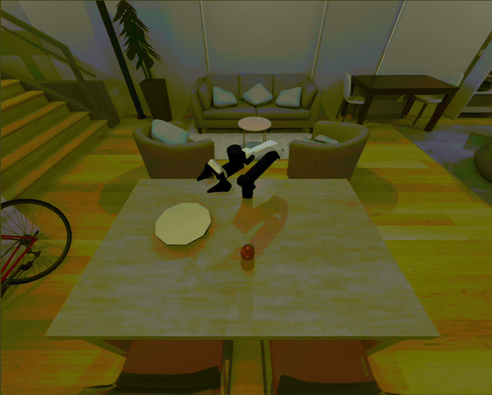

**⚠️ 重要声明：当前采集只使用 ROS2 流程，不使用 ROS1/Noetic/catkin/rosrun。**

# 🤖 Lerobot Anything

  
  
  

---

> **🚀 Bringing Leader-Follower teleoperation system to every real robot and robot arm -- Cheaper, Smoother, Plug-and-Play**
> **💵 Starts from $60 cost!! Then controls any robot arm system!!**

*Built upon the giants: [LeRobot](https://github.com/huggingface/lerobot), [SO-100/SO-101](https://github.com/TheRobotStudio/SO-ARM100), [XLeRobot](https://github.com/Vector-Wangel/XLeRobot#), [Gello](https://github.com/wuphilipp/gello_mechanical/tree/main)*

# 📰 News

- 2025-08-15: **LeRobot Anything 0.1.0** hardware setup, the 1st version fully capable for three major robot arm configurations, starts from 60$.

---

# 📋 Table of Contents

- [Overview](#-overview)
- [✨ Features](#-features)
- [💵 Total Cost](#-total-cost-)
- [🤖 Supported Robots (find your robot in the list!)](#-supported-robots)
- [🚀 Quick Start](#-quick-start)
- [🔮 Roadmap](#-roadmap)
- [🤝 Contributing](#-contributing)

---

## 🎯 Overview

LeRobot Anything is a **low-cost, universal, leader-follower teleoperation system** for any commercial robot arms and humanoid robots(coming soon) through four interchangeable hardware configurations. Designed for researchers, educators, and robotics enthusiasts, it provides a standardized interface for diverse robot platforms. This project focus on extending the Lerobot to control any real robot in both real scene and simulation.

### 🎯 Target Environment (Docker coming soon)

- **OS**: Ubuntu 20.04
- **ROS**: Humble
- **Simulation**: SAPIEN integration (Built upon [ManiSkill](https://github.com/haosulab/ManiSkill))

---

## ✨ Features

| Feature                             | Description                                                                   |
| ----------------------------------- | ----------------------------------------------------------------------------- |
| 🔄**Universal Compatibility** | Four teleop configurations covering **most (95%) commercial robot arms** |
| 📡**ROS Integration**         | Native ROS2 support with `/servo_angles` topic publishing                   |
| 🎮**Real-time Control**       | Low-latency servo angle transmission                                          |
| 🔌**Plug & Play**             | Easy follower-arm integration with provided examples                          |
| 🛠️**Extensible**            | Simple API for adding new robot support                                       |
| 💰**Cost-effective**          | Ultra low-cost hardware solution                                              |
| 🎯**Optimized Hardware**      | Move smoothly and flexibly                                                    |
| 💻**Simulation Test**         | Support teleoperation test in simulation environment                                  |

### 🎮 Ready-to-Use Examples

**Real Robot Examples:**

| Dobot CR5 | xArm Series | ARX5 |
|-----------|-------------|------|
|  |  |  |

**Simulation Examples:**

| SO100 | ARX-X5 | XLeRobot |
|-------|--------|----------|
|  |  |  |

| xArm Series | Franka Panda | Piper |
|-------------|--------------|-------------|
|  |  |  |

 

## 💵 Total Cost 💵

> [!NOTE]
> Cost excludes 3D printing, tools, shipping, and taxes.

| Price                             | US             | EU              | CN               |
| --------------------------------- | -------------- | --------------- | ---------------- |
| **Basic** (use your laptop) | **~$60** | **~€60** | **~¥360** |
| ↑ Servos                         | +$60           | +€60           | +¥405           |

---

## 🤖 Supported Robots (find your robot in the list!)

| Configuration                                                                                                         | Compatible Robot Arms                                                                      | Status   |
| --------------------------------------------------------------------------------------------------------------------- | ------------------------------------------------------------------------------------------ | -------- |
| [**Config 1**](https://github.com/MINT-SJTU/LeRobot-Anything-U-Arm/tree/main/mechanical/Config1_STL) | Xarm6, Fanuc LR Mate 200iD, Trossen ALOHA, Agile PiPER, Realman RM65B, KUKA LBR iiSY Cobot | ✅ Ready |
| [**Config 2**](https://github.com/MINT-SJTU/LeRobot-Anything-U-Arm/tree/main/mechanical/Config2_STL) | Dobot CR5, UR5, ARX R5*, AUBO i5, JAKA Zu7                                                 | ✅ Ready |
| [**Config 3**](https://github.com/MINT-SJTU/LeRobot-Anything-U-Arm/tree/main/mechanical/Config3_STL) | Franka FR3, Franka Emika Panda, Flexiv Rizon, Realman RM75B , Xarm7                               | ✅ Ready |

> 💡 **Need support for a different robot?** Check our [Contributing](#-contributing) section!

---

## 🚀 Quick Start

> [!NOTE]
> If you are totally new to programming, please spend at least a day to get yourself familiar with basic Python, Ubuntu and GitHub (with the help of Google and AI). At least you should know how to set up Ubuntu system, git clone, pip install, use interpreters (VS Code, Cursor, PyCharm, etc.) and directly run commands in the terminals.

1. 💵 **Buy your parts**: [Bill of Materials](https://docs.google.com/document/d/1TjhJOeJXsD5kmoYF-kuWfPju6WSUeSnivJiU7TH4vWs/edit?tab=t.0#heading=h.k991lzlarfb8)
2. 🖨️ **Print your stuff**: [3D printing](https://github.com/MINT-SJTU/Lerobot-Anything-U-arm/tree/main/mechanical)
3. 🔨 [**Assemble**!](Coming Soon)
4. 💻 **Software Env Set up & Real-world Teleop**: [Get your robot moving!](https://github.com/MINT-SJTU/Lerobot-Anything-Uarm/blob/main/howtoplay.md)
5. 🎮 **Simulation**: [Try it out in SAPIEN!](https://github.com/MINT-SJTU/Lerobot-Anything-U-arm/blob/main/src/simulation/README.md)

For detailed hardware guide, check  [Hardware Guide](https://docs.google.com/document/d/1TjhJOeJXsD5kmoYF-kuWfPju6WSUeSnivJiU7TH4vWs/edit?tab=t.0#heading=h.k991lzlarfb8)

<!-- ---

## ⚙️ Hardware Assembly

> 📚 **Detailed build instructions coming soon!**

We're preparing comprehensive documentation including:
- 📋 Complete parts list
- 🔌 Wiring diagrams
- 🔧 Mechanical assembly guide
- 🎥 Video tutorials

**Stay tuned for the Google Drive link with full documentation!** -->

---

## 🔮 Roadmap

### 🎯 TO-DO List

- [X] **SAPIEN Simulation Environment**: Install and Play!

  - Virtual teleop setup mirroring physical hardware
  - Rapid prototyping and testing capabilities
  - Integration with existing SAPIEN workflows
- [x] **ROS2 Support**
- [ ] **Docker Image**
- [ ] **Humanoid System: Config4**

---

## 🤝 Contributing

We welcome contributions! Here's how you can help:

### 💡 Feature Requests

### 🔧 Code Contributions

### 🤖 Adding New Robot Support

---

## 👥 Main Contributors

- **Yanwen Zou** -
- **Zhaoye Zhou** -
- **Chenyang Shi**
- **Zewei Ye** -
- **Jie Yi** -
- **Junda Huang** -
- **Gaotian Wang** -

This project builds upon the excellent work of:

- [LeRobot](https://github.com/huggingface/lerobot) - The foundation for robot learning
- [SO-100/SO-101](https://github.com/TheRobotStudio/SO-ARM100) - Hardware inspiration
- [XLeRobot](https://github.com/Vector-Wangel/XLeRobot) - Extended robot support
- [Gello](https://github.com/wuphilipp/gello_mechanical/tree/main) - Hardware inspiration

Thanks to all the talented contributors behind these detailed and professional projects!

---

**Made with ❤️ for the robotics community**

