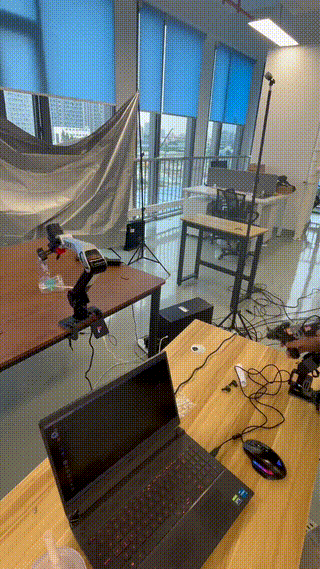

**⚠️ 重要声明：当前采集只使用 ROS2 流程，不使用 ROS1/Noetic/catkin/rosrun。**

# 🤖 Lerobot Anything

  
  
  
 

---

>**🚀 将主从式遥操作系统带到每一个真实机器人与机械臂——更便宜、更顺滑、即插即用**  
**💵 成本低至 $60 起！即可控制任何机械臂系统！**

*基于以下项目构建：[LeRobot](https://github.com/huggingface/lerobot)、[SO-100/SO-101](https://github.com/TheRobotStudio/SO-ARM100)、[XLeRobot](https://github.com/Vector-Wangel/XLeRobot#)*

# 📰 动态 

- 2025-08-15: **LeRobot Anything 0.1.0** 硬件搭建，首个版本在 ROS2 中完整支持三种主流机械臂配置，成本从 60 美元起。

---

# 📋 目录

- [概览](#-概览)
- [功能](#-功能)
- [总成本](#-总成本-)
- [支持的机器人（看看列表里有没有你的！）](#-支持的机器人)
- [快速开始](#-快速开始)
- [路线图](#-路线图)
- [贡献](#-贡献)

---

## 🎯 概览

LeRobot Anything 是一个面向任意商用机械臂与人形机器人的**低成本、通用型主从式遥操作系统**，通过四种可互换的硬件配置实现。它为研究者、教育者和机器人爱好者设计，提供面向多样机器人平台的标准化接口。本项目专注于扩展 Lerobot，以便在真实场景与仿真中控制任何真实机器人。

### 🎯 目标环境（Docker 即将推出）
- **OS**: Ubuntu 20.04
- **ROS**: Humble
- **仿真**: SAPIEN 集成（即将推出）

---

## ✨ 功能

| 功能 | 说明 |
|---------|-------------|
| 🔄 **通用兼容** | 四种遥操作配置覆盖**绝大多数（95%）商用机械臂** |
| 📡 **ROS 集成** | 原生 ROS2 支持，发布 `/servo_angles` 主题 |
| 🎮 **实时控制** | 低延迟舵机角度传输 |
| 🔌 **即插即用** | 提供示例，易于与从动臂集成 |
| 🛠️ **可扩展** | 简洁 API，便于新增机器人支持 |
| 💰 **高性价比** | 超低成本硬件方案 |
| 🎯 **优化硬件** | 运动顺滑、灵活 |

### 🎮 开箱即用的示例

**真实机器人示例：**
- **Dobot CR5** - 完整遥操作搭建
- **xArm 系列** - 完整 ROS 集成  
- **ARX5** - 无需 ROS 的控制示例

**仿真实例：**
- 即将推出

---

## 💵 总成本 💵

> [!NOTE] 
> 成本不包含 3D 打印、工具、运费和税费。

| 价格 | US | EU | CN |
| --- | --- | --- | --- |
| **基础**（使用你的笔记本电脑） | **~$60** | **~€60** | **~¥360** |
| ↑ 舵机 | +$60 | +€60 | +¥405 |

---

## 🤖 支持的机器人

| 配置 | 兼容机械臂 | 状态 |
|---------------|----------------------|---------|
| [**Config 1**](https://github.com/MINT-SJTU/LeRobot-Anything-U-Arm/tree/main/mechanical/Config1_STL) | Xarm7、Fanuc LR Mate 200iD、Trossen ALOHA、Agile PiPER、Realman RM65B、KUKA LBR iiSY Cobot | ✅ 可用 |
| [**Config 2**](https://github.com/MINT-SJTU/LeRobot-Anything-U-Arm/tree/main/mechanical/Config2_STL) | Dobot CR5、UR5、ARX R5*、AUBO i5、JAKA Zu7 | ✅ 可用 |
| [**Config 3**](https://github.com/MINT-SJTU/LeRobot-Anything-U-Arm/tree/main/mechanical/Config3_STL) | Franka FR3、Franka Emika Panda、Flexiv Rizon、Realman RM75B | ✅ 可用 |

> 💡 **需要支持其他机器人？** 查看我们的[贡献](#-贡献)部分！

---
## 🚀 快速开始

> [!NOTE] 
> 如果你完全是编程新手，请至少花一天时间熟悉基础的 Python、Ubuntu 和 GitHub（借助 Google 与 AI）。至少需要了解如何安装 Ubuntu、git clone、pip install、使用解释器（VS Code、Cursor、PyCharm 等），以及在终端中直接运行命令。

1. 💵 **购买零件**：[材料清单（BOM）](https://docs.google.com/document/d/1TjhJOeJXsD5kmoYF-kuWfPju6WSUeSnivJiU7TH4vWs/edit?tab=t.0#heading=h.k991lzlarfb8)
2. 🖨️ **打印部件**：[3D 打印](https://github.com/MINT-SJTU/LeRobot-Anything-U-Arm/tree/main/mechanical)
3. 🔨 [**装配**！](Coming Soon)
4. 💻 **软件**：[让你的机器人动起来！](https://github.com/MINT-SJTU/LeRobot-Anything-U-Arm/blob/main/howtoplay.md)
   
详尽硬件指南请查看：[硬件指南](https://docs.google.com/document/d/1TjhJOeJXsD5kmoYF-kuWfPju6WSUeSnivJiU7TH4vWs/edit?tab=t.0#heading=h.k991lzlarfb8)

<!-- ---

## ⚙️ 硬件装配

> 📚 **详细搭建说明即将推出！**

我们正在准备完整文档，包括：
- 📋 全部零件清单
- 🔌 线路连接图
- 🔧 机械装配指南
- 🎥 视频教程

**请关注后续将发布的包含完整文档的 Google Drive 链接！** -->

---

## 🔮 路线图

### 🎯 即将推出
- [ ] **SAPIEN 仿真环境**：安装即玩！
  - 虚拟遥操作搭建，镜像物理硬件
  - 支持快速原型开发与测试
  - 与现有 SAPIEN 工作流集成

### 🚀 未来特性
 - [x] **ROS2 支持**
- [ ] **Docker 镜像**
- [ ] **人形系统：Config4**

---

## 🤝 贡献

我们欢迎所有形式的贡献！你可以这样参与：

### 💡 功能建议

### 🔧 代码贡献

### 🤖 新增机器人支持

---

## 👥 主要贡献者

- **Yanwen Zou** - 
- **Zhaoye Zhou** -
- **Zewei Ye** -
- **Chenyang Shi** -
- **Jie Yi** - 
- **Junda Huang** - 
- **Gaotian Wang** - 

本项目构建于以下优秀工作的基础之上：
- [LeRobot](https://github.com/huggingface/lerobot) - 机器人学习的基石
- [SO-100/SO-101](https://github.com/TheRobotStudio/SO-ARM100) - 硬件灵感来源
- [XLeRobot](https://github.com/Vector-Wangel/XLeRobot) - 拓展的机器人支持

感谢这些专业而出色项目背后的所有贡献者！

---

**以 ❤️ 献给机器人社区**

